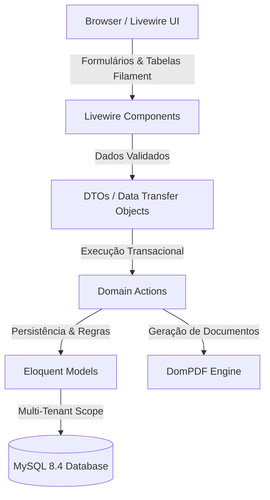
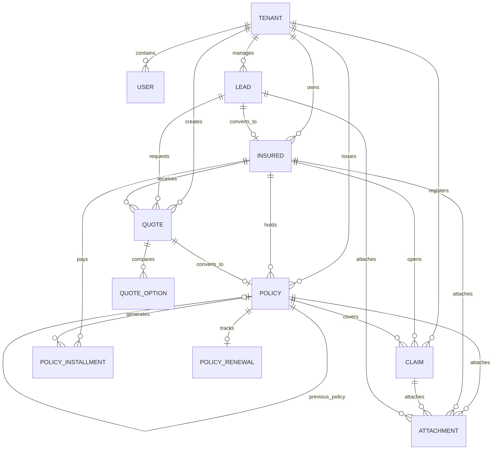

# 🏛️ Arquitetura do Sistema — Insurance Platform

Este documento descreve a arquitetura de software, padrões de design, fluxo de dados e decisões estruturais adotadas na **Insurance Platform**.

---

## 1. Visão Geral da Arquitetura

O projeto adota uma arquitetura baseada em **Domain-Driven Actions**, **Data Transfer Objects (DTOs)**, **Enums Tipados** e uma camada de apresentação rica com **Laravel Livewire 3**, **Alpine.js** e componentes do **Filament 4** (usado como biblioteca de componentes, não como painel administrativo fechado).

---

## 2. Padrões de Projeto (Design Patterns)

### 2.1. Domain Actions (`app/Actions/`)
Toda regra de negócio que altera estado (criação, atualização, transição de estágio, liquidação financeira, clonagem de apólice) é isolada em uma **Action** de responsabilidade única.

* **Isolamento Transacional:** Todas as mutations operam encapsuladas em `DB::transaction()`.
* **Testabilidade:** Cada action pode ser testada unitariamente sem depender do ciclo de vida HTTP.
* **Exemplos de Actions:**
  * `CreatePolicyAction`, `UpdatePolicyAction`
  * `StartPolicyRenewalAction`, `ClonePolicyForRenewalAction`, `UpdateRenewalStageAction`
  * `CreateQuoteAction`, `ConvertQuoteToPolicyAction`
  * `GeneratePolicyInstallmentsAction`, `SettleInstallmentAction`
  * `ConvertLeadToInsuredAction`
  * `StoreAttachmentAction`, `DeleteAttachmentAction`

### 2.2. Data Transfer Objects (`app/DTOs/`)
Objetos imutáveis (`final readonly class`) que transportam dados tipados e sanitizados entre as camadas de apresentação e de domínio.
* `PolicyData`: Normaliza datas Carbon, converte valores decimais monetários e garante *safe defaults* para cálculos de IOF e comissões.

### 2.3. Enums Tipados com Contratos Filament (`app/Enums/`)
Todos os status, ramos e opções do sistema são representados por **Enums nativos do PHP 8.5** implementando os contratos do Filament:
* `HasLabel`: Rótulos em português (`pt_BR`).
* `HasColor`: Cores semânticas para badges (`success`, `warning`, `danger`, `info`, `gray`).
* `HasIcon`: Ícones do Heroicons para tabelas e formulários.
* **Enums Principais:**
  * `InsuranceBranchEnum`: Com regra de alíquota padrão de IOF (`defaultIofRate()`).
  * `PolicyStatusEnum`, `RenewalStageEnum`, `RenewalLossReasonEnum`.
  * `QuoteStatusEnum`, `ClaimStatusEnum`, `ClaimTypeEnum`.
  * `FinancialStatusEnum`, `PaymentMethodEnum`, `AttachmentCategoryEnum`.

### 2.4. Filament como Biblioteca de Componentes
O sistema **não utiliza Filament Resources** tradicionais em rotas fechadas de painel. Em vez disso, utiliza os pacotes isolados:
* `Filament\Forms`: Construtores de formulários reativos (`Grid`, `Section`, `Select`, `TextInput`, `DatePicker`, `Repeater`, `Toggle`).
* `Filament\Tables`: Construtores de tabelas interativas com paginação, buscas, filtros e ações com modais em componentes Livewire.
* `Filament\Infolists`: Fichas de visualização detalhadas de registros.
* `Filament\Notifications`: Toasts de feedback para o usuário.

---

## 3. Modelo de Dados & Relacionamentos

---

## 4. Multi-Tenancy

* Cada tabela de dados possui a coluna `tenant_id` vinculada à corretora proprietária.
* O Trait `BelongsToTenant` aplica escopos automáticos de isolamento por empresa.
* Todas as consultas e mutations respeitam `auth()->user()->tenant_id`.

---

## 5. Geração e Exportação de Documentos

* Motor: **DomPDF** via `barryvdh/laravel-dompdf`.
* Folha de Estilos: CSS inline otimizado para renderização A4 (`@page { size: A4 portrait; margin: 12mm 15mm; }`).
* Nomenclatura Padronizada de Arquivos e autenticação criptográfica SHA-256 no rodapé das apólices.
